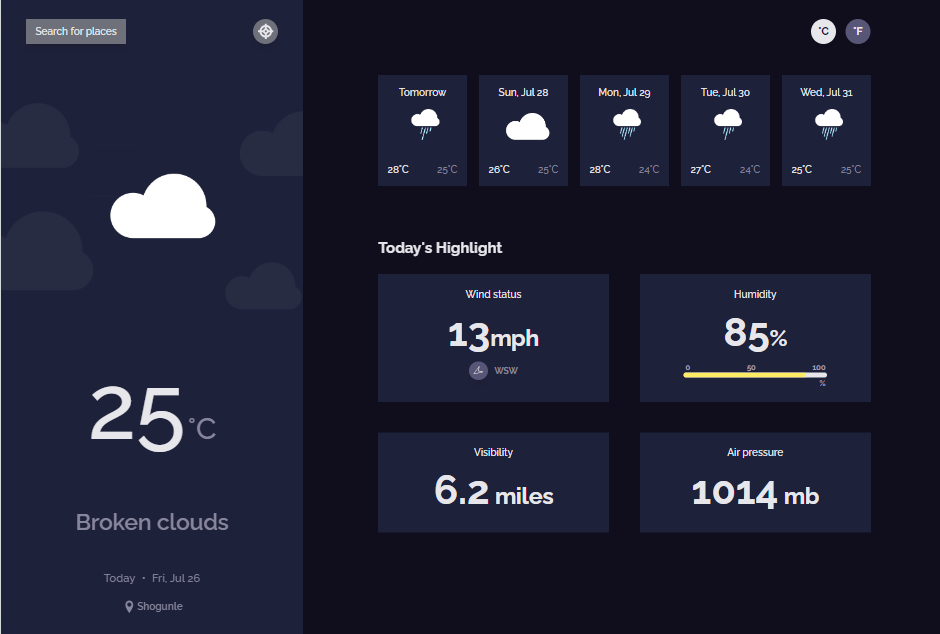

<h1 align="center">Weather Forecast App ☁️🌧️☀️</h1>

<div align="center">
   Solution for a challenge from  <a href="http://devchallenges.io" target="_blank">Devchallenges.io</a>.
</div>

<div align="center">
  <h3>
    <a href="https://naijadevgamer.github.io/rock-paper-scissors/">
      Demo
    </a>
    <span> | </span>
    <a href="https://github.com/naijadevgamer/rock-paper-scissors">
      Solution
    </a>
    <span> | </span>
    <a href="https://legacy.devchallenges.io/challenges/mM1UIenRhK808W8qmLWv">
      Challenge
    </a>
  </h3>
</div>

<!-- TABLE OF CONTENTS -->

## 📋 Table of Contents

- [🌍 Overview](#overview)
  - [🛠️ Built With](#built-with)
- [✨ Features](#features)
- [🚀 How To Use](#how-to-use)
- [📞 Contact](#contact)
- [🙏 Acknowledgements](#acknowledgements)

---

<!-- OVERVIEW -->

## 🌍 Overview



Welcome to my Weather Forecast App! This app is all about giving you accurate and up-to-date weather information for your location or any city you search for. Whether you want to check if you need an umbrella today or plan your weekend trip, this app got you covered! 😎

---

### 🛠️ Built With

This application was built using the following technologies:

- [TypeScript](https://www.typescriptlang.org/)
- [Tailwind CSS](https://tailwindcss.com/)
- [HTML](https://developer.mozilla.org/en-US/docs/Web/HTML)
- [Webpack](https://webpack.js.org/)

### My Experience

Building this weather app was a really fun experience. I learned a lot about working with APIs, TypeScript, and Tailwind CSS. I also enjoyed implementing the MVC architecture, which made my code organized and easy to maintain. I can definitely say I've improved my frontend skills through this project! 💪

One thing I found very interesting was dealing with the OpenWeatherMap API to fetch live data and displaying it in a user-friendly way. Working with weather data is quite fascinating!

### My Wisdom 🌟

Here's a piece of wisdom from my journey: _"Take things step by step, and don't be afraid to experiment."_ Sometimes the best solutions come from trying out different ideas and approaches.

---

## ✨ Features

Here's what the app can do:

- **Default City Weather**: I can see city weather as default, preferably my current location.
- **Search for City**: I can search for city weather information.
- **Today's Weather & 5-Day Forecast**: I can see the weather of today and the next 5 days.
- **Weather Details**: I can see the date and location of the weather.
- **Weather Icons**: I can see images for each type of weather (e.g., sunny, rainy).
- **Temperature Range**: I can see the min and max degree each day.
- **Wind Status & Direction**: I can see the wind status and direction.
- **Humidity**: I can see the humidity percentage.
- **Visibility**: I can see a visibility indicator.
- **Air Pressure**: I can see the air pressure number.
- **Current Location Weather (Optional)**: I can request my current location weather.
- **Temperature Conversion (Optional)**: I can convert temperatures between Celsius and Fahrenheit.
- **Detailed Daily Forecast**: By clicking on a forecast day, I can get wind status, direction, humidity, visibility, and air pressure of each day.
- **Recent Searches**: I can see the last three searches that I have made.

---

## 🚀 How To Use

To clone and run this application, you'll need [Git](https://git-scm.com) and [Node.js](https://nodejs.org/en/download/) (which comes with [npm](http://npmjs.com)) installed on your computer. From your command line:

```bash
# Clone this repository
$ git clone https://github.com/naijadevgamer/weather-forecast-app

# Navigate into the directory
$ cd weather-forecast-app

# Install dependencies
$ npm install

# Build the app
$ npm run build

# Run the app
$ npm start
```

---

## 📞 Contact

Feel free to reach out if you have any questions or suggestions. I’d love to hear from you! 😊

- **GitHub**: [My GitHub Profile](https://github.com/naijadevgamer)
- **Twitter**: [@naijadevgamer](https://www.twitter.com/naijadevgamer)
- **Instagram**: [@naijadevgamer](https://www.instagram.com/naijadevgamer)
- **LinkedIn**: [Abdullah Saleeman](https://www.linkedin.com/in/abdullah-saleeman-360170243)
- **Email**: [sabdullahialaba50@gmail.com](mailto:sabdullahialaba50@gmail.com)

---

## 🙏 Acknowledgements

First and foremost, all praises to Allah for giving me the strength and ability to complete this project.

This project was possible thanks to some amazing resources and tools:

- [OpenWeatherMap API](https://openweathermap.org/api) for providing the weather data.
- [DevChallenges](https://devchallenges.io/) for the inspiration and challenge.
